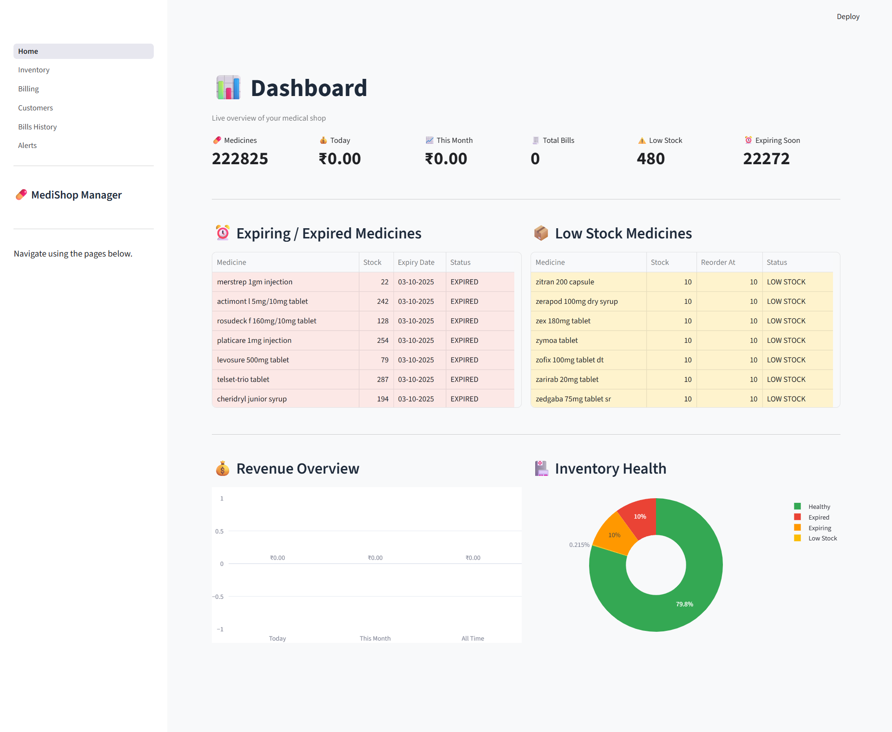
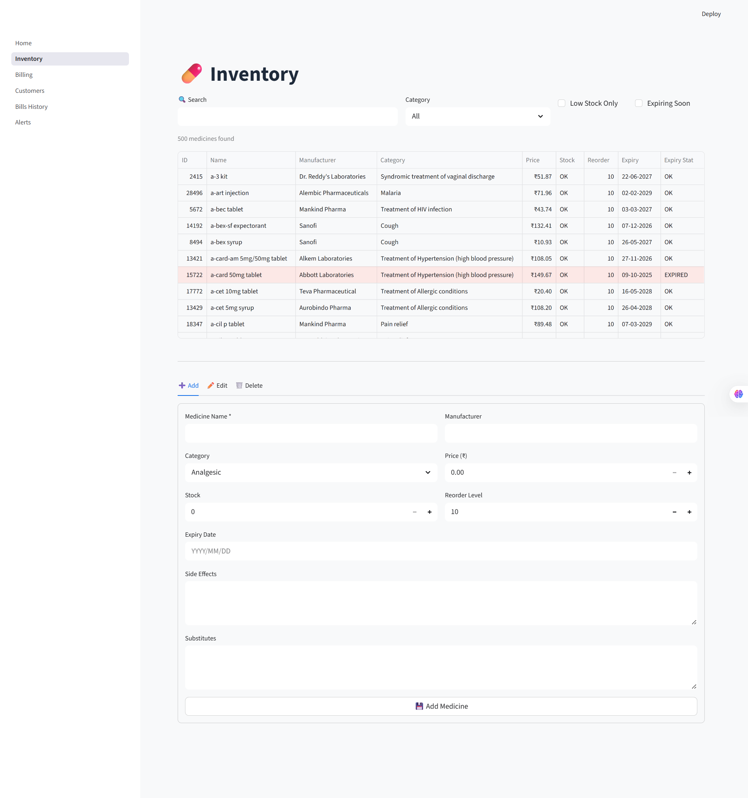
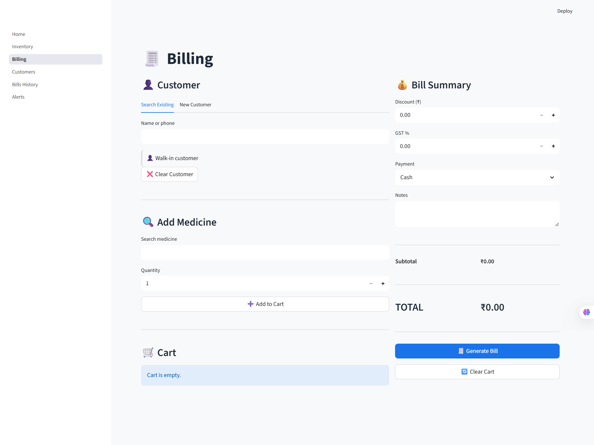
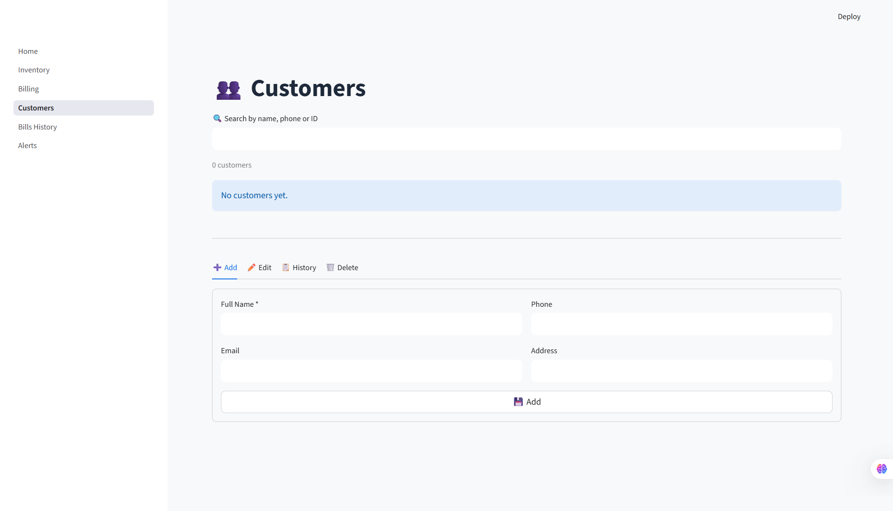
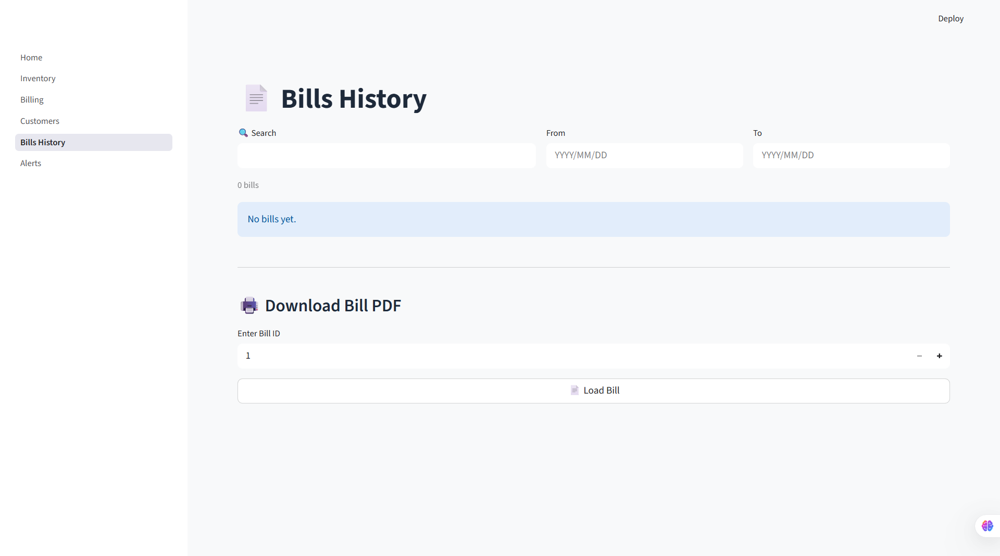

# 💊 MediShop Manager

MediShop Manager is a modern, responsive web application built with **Streamlit** and **PostgreSQL** that completely digitizes the inventory and billing processes of a medical shop.

With an optimized backend designed to smoothly handle large-scale datasets (including Kaggle's 250,000+ medicine records), MediShop provides a lightning-fast experience for tracking low stock, managing customer billing, monitoring expirations, and analyzing shop revenue!

## 🌟 Key Features

- **📊 Live Dashboard**: Instant overview of today's revenue, total medicines loaded, low stock alerts, and expiring medicines.
- **💊 Inventory Management**: Add, edit, delete, and search flawlessly through hundreds of thousands of medicines with dynamic stock-health highlighting.
- **🧾 Point of Sale (Billing)**: Quickly generate detailed invoices, automatically link customers, calculate taxes/discounts, and deduct purchases straight from your active stock.
- **👥 Customer Profiles**: Built-in address book and history for tracking shop customers.
- **🔔 Proactive Alerts**: Automatic alerts warning you about exactly which stock is hitting its re-order level or nearing expiration.
- **📥 Robust Importer**: Securely load massive `.csv` files straight into your PostgreSQL database with automated column mapping, category assignment, and duplicate skipping.

---

## 🚀 Setup & Installation

### 1. Prerequisites
- **Python 3.9+**
- **PostgreSQL**: Ensure you have PostgreSQL installed locally or access to a cloud Postgres instance.

### 2. Clone the Repository
```bash
git clone https://github.com/Anubhab912/medishop.git
cd medishop
```

### 3. Create a Virtual Environment
```bash
python -m venv venv

# On Windows:
.\venv\Scripts\activate
# On Mac/Linux:
source venv/bin/activate
```

### 4. Install Dependencies
```bash
pip install -r requirements.txt
```

### 5. Database Configuration
1. Open the `.env.example` file (or just `config.py`).
2. Update the `DB_CONFIG` settings with your actual PostgreSQL credentials (database name, user, password, host).
3. If using `psql`, create a database first, for example: `CREATE DATABASE medishop;`

### 6. Run the App
```bash
streamlit run Home.py
```
*Note: The app will automatically construct the required database tables the first time it detects they're missing!*

---

## 💾 Importing the Kaggle Dataset

Want to populate the app with real data?
1. Download a medicine dataset from Kaggle (CSV format).
2. Create a folder named exactly `data/` in the root of the project directory.
3. Place your `.csv` file inside `data/`.
4. Run the app, and you'll immediately see a prompt guiding you to the in-app importer to securely stream 250k+ records straight into your DB.

## 📸 App Gallery

| Dashboard | Inventory |
| :---: | :---: |
|  |  |
| **Billing (Point of Sale)** | **Customers** |
|  |  |
| **Bills History** | |
|  | |

## 👨‍💻 Author
**Anubhab Das**  
Feel free to reach out if you have any questions or suggestions regarding the database or the streamlined UI!

## 💡 Feedback & Support
Since this is a personal project, formal contributions aren't tracked, but if you encounter any major bugs or have awesome ideas to improve MediShop Manager, please feel free to open an issue on the GitHub repository.
